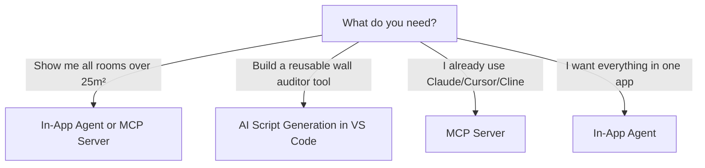

# AI & Agent

Paracore provides **three distinct AI surfaces**, each designed for a different stage of the automation workflow. All three are powered by the same CoreScript engine and fluent DSL — they differ in where you interact with them and what kind of code they produce.

## The Three AI Surfaces

| | In-App Agent | MCP Server | AI Script Generation |
|---|---|---|---|
| **Where** | Paracore Desktop App | Claude Desktop, Cursor, Cline | VS Code |
| **What it does** | Generates + executes REPL code | Same, via external AI tools | Generates gallery scripts with editable parameters |
| **Code style** | Fluent DSL, top-level statements | Fluent DSL, top-level statements | Fluent DSL + `Params` class |
| **Execution** | Immediate (after your approval) | Immediate (after your approval) | You click Run after configuring parameters |
| **Best for** | Quick data exploration, one-off mods | Same, using your preferred AI tool | Building reusable tools and add-ins |
| **API key** | In Paracore LLM Settings | In host app config | In VS Code AI extension |

### When to Use Which

- **In-App Agent**: You're in the Paracore Desktop App. You want quick answers or one-off modifications. The Agent explores your model, writes code, and shows it to you before executing.
- **MCP Server**: You already use Claude Desktop, Cursor, or Cline. You want those tools to have direct Revit access with the same capabilities as the in-app Agent.
- **AI Script Generation**: You want to create a reusable gallery tool with editable parameters (dropdowns, sliders, toggles). You scaffold a workspace in VS Code and use Copilot or Cline to generate the script. The result is a tool you can run repeatedly with different parameter values.

## Shared Foundation

All three surfaces share:

- **CoreScript Engine**: The same Roslyn-powered C# compiler executes all code — fluent DSL, extension methods, and globals work identically everywhere.
- **Human-in-the-Loop**: Code that mutates the Revit model is always shown for your approval before execution. Nothing changes without your consent.
- **Security Scanning**: All AI-generated code is scanned before execution. System-level operations are blocked unconditionally. Network access is blocked for Agent and MCP code (user-written scripts retain network access).
- **Sovereign Code Generation**: Rather than hardcoding thousands of individual tools, the Agent uses one infinitely-capable tool — a C# compiler. It writes code that uses Paracore's fluent DSL, making it shorter, safer, and more capable than traditional BIM AI agents.

---

*Choose your surface: [In-App Agent](./in-app-agent.mdx) | [MCP Server](./mcp-server.mdx) | [AI Script Generation](../authoring/ai-generation.mdx)*
