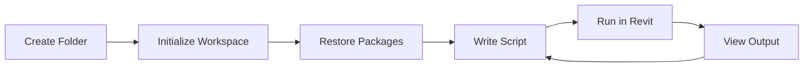

# corescript-vscode Extension

The **corescript-vscode** extension provides a seamless development environment for writing, testing, and executing **CoreScript** (C# Revit API scripts with custom globals) directly from Visual Studio Code, **without needing to install the full Paracore application**.

## Overview

**CoreScript** is a scripting language built on C# with custom global helpers (like `Print`, `Println`, `Show`, `Transact`, `Doc`, etc.) that simplifies Revit API automation. The **corescript-vscode** extension is a powerful tool that allows you to write and execute CoreScript directly against the Revit API. It offers a complete, standalone solution for automating Revit tasks, with the key advantage of immediate execution and feedback without leaving your code editor.

### Key Benefits

- **Full Revit API Access**: Utilize the full power of the Revit API to create sophisticated automation workflows
- **Immediate Execution**: Run your scripts and see the results instantly in the VS Code output channel, enabling a rapid and interactive development cycle
- **No Overhead**: Focus purely on your automation logic. CoreScript removes the need for boilerplate code (`IExternalApplication`, `IExternalCommand`), `.addin` manifests, and manual DLL management
- **Full IntelliSense**: Get real-time code completion and IntelliSense for the Revit API and CoreScript's custom global variables

While the **corescript-vscode** extension is a powerful tool on its own, it also serves as an excellent companion for traditional add-in development. You can:

- **Prototype and Iterate Rapidly**: Use the extension as a live scripting environment to quickly prototype and perfect your core logic before integrating it into a larger add-in with a custom UI
- **Streamline Your Workflow**: Test and debug your code in an agile environment, ensuring it works as expected before you package it into a final add-in

Whether you're looking for a fast and direct way to automate Revit tasks or a way to accelerate your existing add-in development process, **corescript-vscode** provides the tools you need to be more productive.

## Requirements

Before using this extension, you must have the **RServer.Addin** for Revit installed.

1. Download and run `RServer_Installer.exe` from the [Downloads](../getting-started/downloads.md) page
2. Launch Revit
3. Go to the **"Paracore"** tab in the Revit ribbon
4. Click the **"RServer"** toggle button to start the server

## Installation

1. Download `corescript-0.0.1.vsix` from the [Downloads](../getting-started/downloads.md) page
2. Open VS Code
3. Go to Extensions view (`Ctrl+Shift+X`)
4. Click the `...` menu → **Install from VSIX...**
5. Select the downloaded `corescript-0.0.1.vsix` file

## Getting Started

### 1. Create a Workspace

Create a new folder for your scripts:

```bash
# Create and open a folder
mkdir MyRevitScripts
cd MyRevitScripts
code .
```

Alternatively, right-click any folder and select **"Open with Code"**.

### 2. Initialize Workspace

1. Open the Command Palette (`Ctrl+Shift+P`)
2. Type and select: **CoreScript: Initialize Workspace** (or press `Ctrl+Shift+S`)

This command scaffolds your workspace with:
- `.csproj` - Project file with Revit API references
- `global.json` - .NET SDK version configuration
- `.editorconfig` - Code style settings
- `Scripts/` folder containing:
  - `Globals.cs` - IntelliSense helpers
  - `Main.cs` - Your main script entry point
  - `SpiralCreator.cs` - Example helper class

> **Important**: Wait for the workspace to be fully generated. It is complete when the `obj` and `bin` folders are created.

### 3. Restore NuGet Packages

After initialization, VS Code will prompt you to restore packages. Click **"Restore"** to download the Revit API references and enable IntelliSense.

Alternatively, run:
```bash
dotnet restore
```

### 4. Write Your Script

Navigate to the `Scripts` folder. The entry point is `Main.cs`. You can create additional scripts in this folder and reference them in `Main.cs`.

Example script:

```csharp
using Autodesk.Revit.DB;

Println("Creating walls...");

Transact("Create Walls", () =>
{
    // Your Revit API code here
    var level = GetLevel("Level 1");
    // ... create elements
});

Println("Done!");
```

### 5. Execute in Revit

1. Make sure Revit is running with the RServer add-in loaded
2. Open Command Palette (`Ctrl+Shift+P`)
3. Type and select: **CoreScript: Run in Revit** (or press `Ctrl+Shift+R`)

The script executes in Revit, and output appears in the **VS Code Output panel** (View → Output → CoreScript).

## Keyboard Shortcuts

- **`Ctrl+Shift+S`** (Mac: `Cmd+Shift+S`) - Initialize Workspace
- **`Ctrl+Shift+R`** (Mac: `Cmd+Shift+R`) - Run in Revit

## Features

### Full IntelliSense Support

The workspace is configured with:
- Full Revit API IntelliSense
- Auto-completion for classes, methods, and properties
- Parameter hints
- Documentation tooltips

### CoreScript Global Helpers

**CoreScript** provides convenient global functions (via `Globals.cs`) that simplify Revit API scripting:

- `Println(message)` - Print to output
- `Transact(name, action)` - Execute code in a Revit transaction
- `Doc` - Access the active Revit document
- `GetLevel(name)` - Get a level by name
- And more...

### Multi-File Scripts

You can organize your code into multiple files:

```
Scripts/
├── Main.cs           # Entry point
├── WallCreator.cs    # Helper class
├── ColumnHelper.cs   # Another helper
└── Globals.cs        # Auto-generated
```

All `.cs` files in the `Scripts/` folder (except `Globals.cs`) are automatically included when you run the script.

## Execution Output

Results from your script execution are displayed in the **VS Code Output** channel.

- **Print Statements**: Any `Print()` or `Println()` calls in your script will appear here
- **Status Messages**: Even if your script has no output, the engine provides a status message for every execution

### Success

```text
✅ Code executed successfully | Tuesday 16, December 2025 | 03:45:22 PM
```

### Failure

If an error occurs, the output will show the failure status and the exception details:

```text
❌ Script execution failed | Tuesday 16, December 2025 | 04:15:39 PM
[ERROR] Autodesk.Revit.Exceptions.ArgumentNullException: The input argument "curve" of...
```

## Architecture

This extension functions as a gRPC client that establishes a direct connection with the `RServer.Addin` running within Revit. This provides a convenient and efficient workflow for developers to write and test scripts without leaving the VS Code environment.

## Workflow



## Tips

- **Keep Revit Open**: The RServer add-in must be running in Revit for script execution
- **Check Output**: Always check the Output panel for execution results and errors
- **Use Transactions**: Wrap any Revit API calls that modify the model in `Transact()`
- **Organize Code**: Use multiple files for complex scripts to keep code maintainable

## Troubleshooting

### "No response from CoreScript server"
- Ensure Revit is running
- Check that the RServer add-in is loaded (look for the "RServer" button in Revit)
- Verify the add-in status shows "On"

### IntelliSense not working
- Run `dotnet restore` in the workspace folder
- Restart VS Code
- Check that `.csproj` file exists in the workspace root

### Script compilation errors
- Check the Output panel for detailed error messages
- Ensure all `using` statements are correct
- Verify Revit API syntax (e.g., `UnitTypeId` vs deprecated `DisplayUnitType`)

## Next Steps

- Explore the [Script Execution](./script-execution.md) guide for advanced features
- Learn about [Parameters & Presets](./parameters-presets.md) for dynamic scripts
- Check out [Code Editing with VSCode](./code-editing-with-vscode.md) for integration with Paracore
